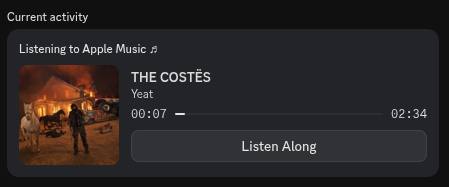

# amrpc-userscript

another **Apple Music** rich presence project, but made for the web version of AM. 
this rpc client uses a normal userscript (that can be loaded via tampermonkey) and
a backend that updates your discord rich presence (since its kindaa difficult to
achieve that in a browser environment)

## Preview

 

the **[ Listen Along ]** button redirects to the song's [song.link](https://song.link/i/1774384684) page

## Requirements

- rust (for building the backend)
- userscript extension (tampermonkey)

## Installation

1. register the [userscript](./browser/userscript.js) via your preferred extension
2. go into the server folder: `cd server`
3. build the server (ONCE): `cargo build --release`
4. run the `amrpc-proxy` executable found in `./target/release/`

## Notice

- rpc only works when backend is alive
- ^ so add it to your startups
- doesnt work on the web version of discord (app only, with rpc support)
